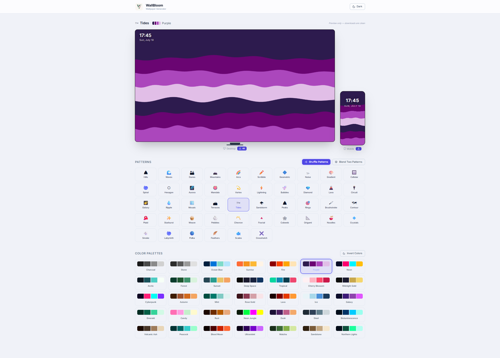

# 🎨 WallBloom - AI Wallpaper Generator

<p align="center">
  
</p>

<p align="center">
  <strong>Procedural Wallpaper Generator with 100+ Patterns & 50+ Color Palettes</strong>
</p>

<p align="center">
  <a href="#-features">Features</a> •
  <a href="#-quick-start">Quick Start</a> •
  <a href="#-technology-stack">Tech Stack</a> •
  <a href="#-api-documentation">API</a> •
  <a href="#-deployment">Deployment</a>
</p>

---

<p align="center">
  
  
  
  
  
</p>

---

WallBloom is a modern, high-performance wallpaper generator that creates stunning procedural patterns using Python backend and React frontend. Generate unique wallpapers with deterministic algorithms, customize with beautiful color palettes, and export in high-resolution for desktop and mobile devices.

## ✨ Features

### 🎨 100+ Procedural Patterns

Generate unique patterns with deterministic algorithms:

- **Nature**: Hills, Waves, Dunes, Mountains, Peaks, Terraces, Tides, Sandstorm, Sand Ripple, Tree Rings, Cracks, Roots, Vines, Bamboo, Clouds, Coral, Snowflakes, Raindrops, Lava, Volcanic Ash
- **Geometric**: Arcs, Scribble, Geometric, Hexagon, Diamond, Rings, Chevron, Fractal, Maze, Labyrinth, Crosshatch, Plaid, Weave, Patchwork, Wire Frame
- **Abstract**: Noise, Gradient, Cellular, Spiral, Vortex, Aurora, Mandala, Galaxy, Ripple, Mosaic, Brushstroke, Contour, Starburst, Pebbles, Cobweb, Origami, Noodles, Crystals, Smoke, Polka, Feathers, Scales, DNA, Binary Rain, Radar, Topographic, Waveform, Satellite, Sonar, Datastream, Fiber Optic, Neural, Lenticular, Glitch, Stained Glass, Honeycomb Flow, Pixel Sort, Lightning Field, Soap Bubble, Celtic Knot, Meteor Shower, Brush Grid, Neon Grid, Sunburst, Droplets
- **Advanced**: Voronoi, Kaleidoscope, Triangular Mesh, Pinwheel, Prism, Hypnotic, Plasma, Interference, Turbulence, Ink Blot, Watercolor, Pointillism, Constellation, Lace, Mushroom, Topsoil, Fish Net

### 🌈 50+ Color Palettes

Beautifully curated color palettes:

- **Earth Tones**: Charcoal, Stone, Sandstone, Rust, Copper, Steel, Slate Blue, Obsidian
- **Nature**: Ocean Blue, Forest, Arctic, Sunset, Deep Space, Tropical, Autumn, Mint, Emerald, Jade, Seafoam, Teal Storm, Northern Lights, Coral Reef, Lavender, Peacock, Blood Moon, Ultraviolet, Matcha, Dusk, Bioluminescence
- **Vibrant**: Sunrise, Fire, Purple, Neon, Cyberpunk, Neon Jungle, Bubblegum, Toxic, Tangerine, Crimson, Amber, Coral, Galaxy, Ice, Cherry Blossom, Midnight Gold, Lava, Ice, Ultraviolet, Bubblegum, Toxic
- **Special**: Moonlight, Tangerine, Seafoam, Obsidian, Bubblegum, Toxic, Amethyst, Sapphire, Ruby, Emerald, Jade, Citrine, Topaz, Ametrine, Tanzanite, Aquamarine, Turquoise, Lapis, Azurite, Malachite, Onyx, Jasper, Agate, Carnelian, Citrine, Topaz, Amethyst, Tanzanite, Aquamarine, Turquoise, Lapis, Azurite, Malachite, Onyx, Jasper, Agate, Carnelian

### 📸 High-Resolution Export

- **Desktop**: 3840×2160 (4K UHD)
- **Mobile**: 1290×2796 (iPhone Pro Max)
- **Custom**: Any resolution supported

### 🔄 Real-Time Preview

- Desktop (16:9) and Mobile (9:19.5) side-by-side preview
- Live updates as you change patterns/palettes
- Clock overlay for realistic preview
- Instant feedback with no latency

### 🎯 Advanced Features

- **Pattern Blending**: Combine two patterns with adjustable ratios
- **Color Inversion**: Toggle between light and dark modes
- **Deterministic Generation**: Same seed = same image (reproducible)
- **Shuffle**: Generate infinite variations with one click
- **Theme Toggle**: Switch between light and dark UI themes
- **Responsive Design**: Works on desktop and mobile browsers

### 🚀 Performance

- **Backend**: ~50-100ms for preview, ~500-1000ms for 4K
- **Frontend**: Real-time with HMR (Hot Module Reload)
- **Optimized**: Production build with minification and caching

---

## 🚀 Quick Start (5 Minutes)

### Prerequisites

- **Python 3.9+** (Backend)
- **Node.js 16+** (Frontend)
- **pip** (Python package manager)
- **npm** (Node package manager)

### Terminal 1: Start Backend

```bash
cd backend
pip install -r requirements.txt
python main.py
```

**Expected output**:
```
INFO:     Uvicorn running on http://0.0.0.0:8000
INFO:     Application startup complete
```

✅ Backend running on http://localhost:8000

### Terminal 2: Start Frontend

```bash
cd frontend
npm install
npm run dev
```

**Expected output**:
```
VITE v4.4.0  ready in 123 ms

➜  Local:   http://localhost:3000/
```

✅ Frontend running on http://localhost:3000

### Open Browser

Visit **http://localhost:3000** 🎉

---

## 📁 Project Structure

```
aurawall/
├── backend/                          # Python FastAPI backend
│   ├── main.py                       # FastAPI application
│   ├── pattern_engine.py             # Pattern generation engine
│   ├── requirements.txt              # Python dependencies
│   ├── .env                          # Environment configuration
│   └── README.md                     # Backend documentation
│
├── frontend/                         # React 18 frontend
│   ├── src/
│   │   ├── pages/
│   │   │   └── Home.tsx             # Main page component
│   │   ├── services/
│   │   │   └── api.ts               # API client service
│   │   ├── assets/
│   │   │   └── wallbloom-logo.svg   # Logo asset
│   │   ├── App.tsx                  # Main app component
│   │   ├── main.tsx                 # Entry point
│   │   └── index.css                # Global styles
│   ├── public/                       # Static assets
│   │   └── 404.html                 # SPA routing fix
│   ├── package.json                 # Dependencies
│   ├── vite.config.ts               # Vite configuration
│   ├── tsconfig.json                # TypeScript configuration
│   ├── tailwind.config.js           # Tailwind CSS configuration
│   ├── index.html                   # HTML entry point
│   └── README.md                    # Frontend documentation
│
├── doc/                              # Documentation assets
│   └── wallBloom.png                # UI screenshot
│
├── .github/                          # GitHub workflows
│   └── workflows/
│       └── deploy.yml               # Auto-deployment workflow
│
├── render.yaml                       # Render.com configuration
├── DEPLOYMENT.md                     # Deployment guide
├── SETUP_GUIDE.md                    # Detailed setup guide
├── .gitignore                        # Git ignore rules
└── README.md                         # This file
```

---

## 🔧 Technology Stack

### Backend

| Technology | Version | Purpose |
|------------|---------|---------|
| **Python** | 3.9+ | Core language |
| **FastAPI** | 0.104+ | Web framework |
| **Uvicorn** | 0.24+ | ASGI server |
| **PIL/Pillow** | 10.1+ | Image generation |
| **Pydantic** | 2.5+ | Data validation |
| **python-dotenv** | 1.0+ | Environment management |

### Frontend

| Technology | Version | Purpose |
|------------|---------|---------|
| **React** | 18.2+ | UI library |
| **TypeScript** | 5.1+ | Type safety |
| **Vite** | 4.4+ | Build tool |
| **Tailwind CSS** | 3.3+ | Styling |
| **Axios** | 1.6+ | HTTP client |
| **Lucide React** | 0.263+ | Icons |

### Deployment

| Platform | Purpose |
|----------|---------|
| **Render.com** | Backend hosting (free tier) |
| **GitHub Pages** | Frontend hosting (free tier) |
| **Docker** | Containerization |
| **GitHub Actions** | CI/CD automation |

---

## 📊 API Documentation

### Base URL

```
http://localhost:8000
```

### Endpoints

#### Health Check

```http
GET /health
```

**Response**:
```json
{
  "status": "healthy",
  "timestamp": "2024-01-01T00:00:00.000000",
  "service": "WallBloom Backend"
}
```

#### List Patterns

```http
GET /api/patterns
```

**Response**:
```json
{
  "patterns": [
    {
      "type": "hills",
      "name": "Hills",
      "description": "A hills pattern"
    }
  ]
}
```

#### List Palettes

```http
GET /api/palettes
```

**Response**:
```json
[
  {
    "id": 0,
    "name": "Charcoal",
    "colors": ["#1a1a1a", "#4a4a4a", "#8a8a8a", "#d0d0d0"],
    "description": "Palette: Charcoal",
    "is_preset": true,
    "created_at": "2024-01-01T00:00:00",
    "updated_at": "2024-01-01T00:00:00"
  }
]
```

#### Generate Preview Image

```http
GET /api/wallpapers/preview
```

**Query Parameters**:

| Parameter | Type | Default | Description |
|-----------|------|---------|-------------|
| `pattern_type` | string | "hills" | Pattern type |
| `palette_index` | integer | 0 | Palette index (0-49) |
| `seed` | integer | 12345 | Random seed |
| `inverted` | boolean | false | Invert colors |
| `width` | integer | 800 | Image width |
| `height` | integer | 600 | Image height |
| `pattern_type_2` | string | null | Second pattern for blending |
| `blend_ratio` | float | 0.5 | Blend ratio (0-1) |

**Response**: PNG image

#### Download Desktop Wallpaper (4K)

```http
GET /api/wallpapers/download/desktop
```

**Query Parameters**: Same as preview endpoint

**Response**: PNG image (3840×2160)

#### Download Mobile Wallpaper

```http
GET /api/wallpapers/download/mobile
```

**Query Parameters**: Same as preview endpoint

**Response**: PNG image (1290×2796)

---

### Interactive API Docs

Once the backend is running, visit:

- **Swagger UI**: http://localhost:8000/docs
- **ReDoc**: http://localhost:8000/redoc

---

## 🎯 How It Works

### Pattern Generation Algorithm

1. **User Input**: Select pattern type, palette, and seed
2. **Seeded RNG**: Initialize deterministic random number generator
3. **Pattern Engine**: Generate pattern using PIL/Pillow
4. **Color Application**: Apply selected color palette
5. **Export**: Convert to PNG format

### Deterministic Generation

- **Same seed + pattern + palette = Same image**
- Perfect for reproducibility
- Uses Python's `random.Random(seed)` for consistency

### Color Inversion

- Toggle between light and dark modes
- Inverts RGB values: `(255-R, 255-G, 255-B)`

### Pattern Blending

- Combine two patterns with adjustable ratio
- Uses PIL's `Image.blend()` for smooth transitions
- Ratio: 0.0 = Pattern A only, 1.0 = Pattern B only

---

## 🛠️ Development

### Backend Development

```bash
cd backend

# Start development server (auto-reload)
python main.py

# Format code
pip install black
black main.py pattern_engine.py

# Type checking
pip install mypy
mypy main.py pattern_engine.py

# Run tests
pytest
```

### Frontend Development

```bash
cd frontend

# Start development server (HMR enabled)
npm run dev

# Build for production
npm run build

# Preview production build
npm run preview

# Lint code
npm run lint

# Type check
npx tsc --noEmit
```

---

## 🚀 Production Deployment

### Option 1: Deploy to Render + GitHub Pages (Recommended)

See [DEPLOYMENT.md](DEPLOYMENT.md) for complete deployment guide.

**Steps**:
1. Push code to GitHub repository
2. Deploy backend to Render.com (free tier)
3. Deploy frontend to GitHub Pages (free tier)
4. Configure environment variables
5. Auto-deploy on every push

**Live URLs**:
- Frontend: `https://<username>.github.io/WallBloom/`
- Backend: `https://wallbloom.onrender.com`

### Option 2: Docker Deployment

**Backend**:
```bash
cd backend
docker build -t wallbloom-backend .
docker run -p 8000:8000 wallbloom-backend
```

**Frontend**:
```bash
cd frontend
npm run build
docker run -d -p 80:80 -v $(pwd)/dist:/usr/share/nginx/html nginx
```

### Option 3: Cloud Platforms

**Backend**:
- Heroku: `git push heroku main`
- Railway: Connect GitHub repo
- Render: Connect GitHub repo
- AWS: Elastic Beanstalk, Lambda
- Google Cloud: Cloud Run
- DigitalOcean: App Platform

**Frontend**:
- Vercel: `vercel`
- Netlify: `netlify deploy --prod --dir=dist`
- GitHub Pages: Auto-deploy via GitHub Actions
- Cloudflare Pages: Auto-deploy

---

## 🐛 Troubleshooting

### Backend Issues

#### Port 8000 Already in Use

```bash
# Windows
netstat -ano | findstr :8000
taskkill /PID <PID> /F

# Linux/Mac
lsof -i :8000
kill -9 <PID>

# Use different port
PORT=8001 python main.py
```

#### Module Not Found

```bash
pip install -r requirements.txt
```

#### Python Version Error

```bash
python --version  # Should be 3.9+
```

### Frontend Issues

#### Port 3000 Already in Use

```bash
npm run dev -- --port 3001
```

#### Module Not Found

```bash
rm -rf node_modules package-lock.json
npm install
```

#### Backend Connection Error

1. Verify backend is running: `curl http://localhost:8000/health`
2. Check `.env`: `VITE_API_URL=http://localhost:8000`
3. Check browser console (F12)
4. Check network tab for failed requests

### Common Errors

| Error | Solution |
|-------|----------|
| "Port already in use" | Kill existing process or use different port |
| "Module not found" | Install dependencies |
| "Backend not responding" | Verify backend is running |
| "CORS error" | Backend CORS middleware allows all origins |
| "Image not downloading" | Check browser download settings |

---

## 📚 Documentation

| Document | Description |
|----------|-------------|
| [SETUP_GUIDE.md](SETUP_GUIDE.md) | Detailed setup instructions |
| [DEPLOYMENT.md](DEPLOYMENT.md) | Production deployment guide |
| [backend/README.md](backend/README.md) | Backend API documentation |
| [frontend/README.md](frontend/README.md) | Frontend documentation |

---

## 💡 Tips & Best Practices

### Development

- Backend auto-restarts on file changes
- Frontend has HMR (Hot Module Reload)
- Use browser DevTools (F12) for debugging
- Check console for errors
- Use deterministic seeds for reproducible results

### Performance

- Use production build for frontend: `npm run build`
- Enable caching in backend
- Monitor network requests
- Check image generation times
- Optimize images before deployment

### Customization

**Add New Pattern**:
1. Edit `backend/pattern_engine.py`
2. Add function `generate_my_pattern()`
3. Add to `PatternType` enum
4. Add to pattern generation logic

**Add New Palette**:
1. Edit `backend/pattern_engine.py`
2. Add to `PRESET_PALETTES` list
3. Frontend automatically picks it up

**Change UI Colors**:
1. Edit `frontend/tailwind.config.js`
2. Modify theme colors
3. Frontend auto-reloads

---

## 🤝 Contributing

We welcome contributions! Here's how you can help:

1. Fork the repository
2. Create a feature branch: `git checkout -b feature/amazing-feature`
3. Commit your changes: `git commit -m 'Add amazing feature'`
4. Push to the branch: `git push origin feature/amazing-feature`
5. Open a Pull Request

### Contribution Guidelines

- Follow existing code style
- Add tests for new features
- Update documentation as needed
- Keep PRs focused and small
- Be respectful and constructive

---


---

## 🌟 Acknowledgments

- PIL/Pillow team for amazing image processing library
- FastAPI team for the incredible web framework
- React team for the revolutionary UI library
- All contributors and users of WallBloom

---

## 📞 Support

### Documentation

- **Setup**: See [SETUP_GUIDE.md](SETUP_GUIDE.md)
- **Deployment**: See [DEPLOYMENT.md](DEPLOYMENT.md)
- **Backend**: See [backend/README.md](backend/README.md)
- **Frontend**: See [frontend/README.md](frontend/README.md)

### API Documentation

- **Swagger UI**: http://localhost:8000/docs
- **ReDoc**: http://localhost:8000/redoc

### Debugging

1. Check browser console (F12)
2. Check network tab for API calls
3. Check backend logs in terminal
4. Check frontend logs in terminal

---

## 🎉 Success!

If you can:
1. ✅ Access http://localhost:3000
2. ✅ See wallpaper patterns
3. ✅ Generate wallpapers
4. ✅ Download wallpapers

**Congratulations! Your WallBloom setup is complete! 🚀**

---

## 📊 Project Stats

- **Patterns**: 100+ procedural generation algorithms
- **Palettes**: 50+ curated color schemes
- **Resolutions**: 4K desktop + mobile optimized
- **Performance**: <100ms preview generation
- **Code Quality**: TypeScript + type checking
- **Documentation**: Comprehensive guides

---

**Happy creating! 🎨✨**

---

<p align="center">
  <strong>WallBloom - Where Art Meets Technology</strong>
</p>

<p align="center">
  
  
  
  
</p>
